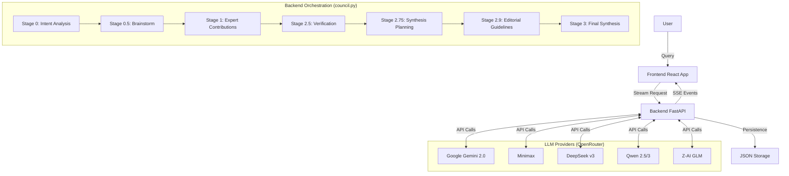

# LLM Council System Architecture

**Version:** 2.0 (Sequential Expert Collaboration Model)
**Date:** January 2, 2026

## 1. Project Overview

**LLM Council** is an advanced diverse-intelligence orchestration system that solves complex user queries by assembling a custom team of LLM experts. Unlike standard chat interfaces, it uses a **7-Stage Sequential Collaboration Pipeline** where agents specifically brainstorm, contribute, verify, plan, and synthesize a final artifact.

### Core Philosophy

- **Collaboration > Debate**: Experts build upon each other rather than arguing.
- **Upfront Planning**: Intent and expert team are defined *before* any content generation.
- **Rigorous Verification**: Claims are fact-checked mid-stream.
- **Synthesized Output**: The user receives one authoritative final artifact, not a thread of chat messages.

---

## 2. Architecture Diagram

The system is a **monolithic full-stack application**:

- **Backend**: FastAPI (Python) - Orchestrates LLM calls and manages state.
- **Frontend**: React (Vite) - Renders the streaming, multi-stage process.
- **Model Layer**: OpenRouter API - Accesses diverse models (Gemini, Claude, GPT-4, etc.).



---

## 3. The 7-Stage Pipeline (Details)

All orchestration logic resides in `backend/council.py`.

### 1. Intent Analysis (`stage0_analyze_intent`)

- **Input**: User query.
- **Goal**: Understand explicit/implicit goals and constraints.
- **Output**: JSON `intent_analysis`.

### 2. Expert Brainstorm (`stage_brainstorm_experts`)

- **Process**: All 6 configured models generate expert suggestions in parallel.
- **Synthesis**: Chairman model synthesizes the best 6 experts from these suggestions.
- **Output**: List of 6 experts with specific Roles, Tasks (50+ words), and Measurable Objectives.

### 3. Sequential Contributions (`stage1_sequential_contributions`)

- **Process**: Experts 1-6 run sequentially.
- **Context**: Each expert sees the query, intent, and *all prior contributions*.
- **Quality Control**: Prompts mandate finding inaccuracies/assumptions in previous work before adding new value.
- **Model Rotation**: Models are rotated round-robin from `COUNCIL_MODELS`.

### 4. Verification (`stage_verification`)

- **Process**: Meticulous fact-checker reviews critical claims in contributions.
- **Output**: Verified/Debunked status for key points.

### 5. Synthesis Planning (`stage_synthesis_planning`)

- **Process**: "Synthesis Architect" defines a roadmap for the final output.
- **Output**: Missing elements, reasoning gaps, recommended structure, checklist.

### 6. Editorial Guidelines (`stage_editorial_guidelines`)

- **Process**: "Editorial Director" defines the voice, tone, and style.
- **Output**: Guidelines for audience calibration, formatting, and "anti-patterns".

### 7. Final Synthesis (`stage3_synthesize_final`)

- **Process**: Chairman (High-intelligence model) writes the final response.
- **Mandate**: Must follow Synthesis Plan + Editorial Guidelines + verification data.
- **Output**: A single, polished Markdown artifact.

---

## 4. Key Configuration

Configuration is centralized in `backend/config.py`.

### Models (`COUNCIL_MODELS`)

The pool of models used for expert roles. Currently configured with 6 distinct high-IQ models:

1. `minimax/minimax-m2.1`
2. `deepseek/deepseek-v3.2`
3. `qwen/qwen2.5-vl-72b-instruct`
4. `z-ai/glm-4.7`
5. `moonshotai/kimi-k2-0905`
6. `qwen/qwen3-235b-a22b-2507`

### Chairman (`CHAIRMAN_MODEL`)

The model responsible for synthesis tasks (Planning, Team Selection, Final Output).

- Current: `minimax/minimax-m2.1`

### Experts

- **Count**: `NUM_EXPERTS = 6` (in `backend/council.py`)

---

## 5. Directory Structure

```
Council/
├── backend/
│   ├── main.py          # FastAPI app, SSE streaming endpoints
│   ├── council.py       # CORE LOGIC: All stage functions
│   ├── config.py        # Model configuration & keys
│   ├── storage.py       # simple JSON file persistence
│   └── openrouter.py    # LLM API client wrapper
├── frontend/
│   ├── src/
│   │   ├── App.jsx             # Main state machine, handling SSE events
│   │   ├── components/
│   │   │   ├── ChatInterface.jsx   # Main view, renders stages
│   │   │   ├── ContributionsStage.jsx # Visualization of Experts 1-6
│   │   │   ├── Stage0.jsx          # Intent & Team display
│   │   │   └── Stage3.jsx          # Final Artifact display
│   │   └── api.js              # Fetch wrappers
└── data/conversations/  # JSON storage of chat history
```
