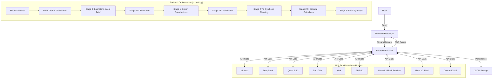

# LLM Council System Architecture

**Version:** 2.2 (Sequential Expert Collaboration Model)
**Date:** January 4, 2026

## 1. Project Overview

**LLM Council** is an advanced diverse-intelligence orchestration system that solves complex user queries by assembling a custom team of LLM experts. Unlike standard chat interfaces, it uses an **8-stage Sequential Collaboration Pipeline** preceded by a model selection phase and an intent clarification loop.

### Core Philosophy

- **Collaboration > Debate**: Experts build upon each other rather than arguing.
- **Upfront Planning**: Intent and expert team are defined *before* any content generation.
- **Rigorous Verification**: Claims are fact-checked mid-stream.
- **Synthesized Output**: The user receives one authoritative final artifact, not a thread of chat messages.

---

## 2. Architecture Diagram

The system is a **monolithic full-stack application**:

- **Backend**: FastAPI (Python) - Orchestrates LLM calls and manages state.
- **Frontend**: React (Vite) - Renders the streaming, multi-stage process.
- **Model Layer**: OpenRouter API - Accesses diverse models (Minimax, DeepSeek, Qwen, GLM, Kimi, GPT-5.2, Gemini 3 Flash, Mimo, Devstral).



---

## 3. The Pipeline (Details)

All orchestration logic resides in `backend/council.py`.

### 0. Model Selection (UI + API)

- **Input**: User-selected chairman model + expert model pool
- **Rules**: At least 1 expert model must be selected; models can be reused across experts; per-model thinking can be enabled when supported
- **UI Behavior**: New threads start with no preselected models; the user explicitly chooses before running
- **Output**: Model selection metadata stored with the message

### 1. Intent Draft + Clarification (`stage0_generate_intent_draft`)

- **Input**: User query + optional conversation context.
- **Goal**: Produce a draft intent model and 3–6 clarification questions.
- **Output**: `intent_draft`, `intent_display`, and `clarification_questions` for the UI.

### 2. Brainstorm Intent Brief (`stage0_finalize_intent`)

- **Input**: User query + draft intent + clarification answers (or skip).
- **Goal**: Produce a concise, assumption-free brief that guides expert brainstorming.
- **Output**: Markdown intent brief (no JSON) with goals, constraints, deliverable expectations, and execution guidance.

### 3. Expert Brainstorm (`stage_brainstorm_experts`)

- **Process**: All selected expert models generate expert suggestions in parallel.
- **Synthesis**: Chairman model synthesizes the final expert team.
- **Output**: A fixed team of 6 experts with specific Roles, Tasks (50+ words), and Measurable Objectives.

### 4. Sequential Contributions (`stage1_sequential_contributions`)

- **Process**: Experts run sequentially based on the selected pool.
- **Context**: Each expert sees the query, intent, and *all prior contributions*.
- **Quality Control**: Prompts mandate finding inaccuracies/assumptions in previous work before adding new value.
- **Model Rotation**: Models are rotated round-robin from the selected expert pool.

### 5. Verification (`stage_verification`)

- **Process**: Meticulous fact-checker + reasoning auditor reviews critical claims and logic across contributions.
- **Model**: Runs on the user-selected Chairman model; web search (if triggered) uses `openai/gpt-4o-mini-search-preview`.
- **Search Scope**: Builds an exhaustive verification scope from contributions (used only to generate search targets).
- **Search Query Count**: Scales with scope size (min 3, max 8) to cover critical risk areas.
- **Output**: Only `## Search Status` (optional) + `## Verification & Reasoning Audit` are returned.

### 6. Synthesis Planning (`stage_synthesis_planning`)

- **Process**: "Synthesis Architect" defines a roadmap for the final output.
- **Model**: Runs on the user-selected Chairman model for consistency.
- **Output**: Missing elements, reasoning gaps, recommended structure, checklist.

### 7. Editorial Guidelines (`stage_editorial_guidelines`)

- **Process**: "Editorial Director" defines the voice, tone, and style.
- **Model**: Runs on the user-selected Chairman model for consistency.
- **Output**: Guidelines for audience calibration, formatting, and "anti-patterns".

### 8. Final Synthesis (`stage3_synthesize_final`)

- **Process**: Chairman (High-intelligence model) writes the final response.
- **Mandate**: Must follow Synthesis Plan + Editorial Guidelines + verification data.
- **Output**: A single, polished Markdown artifact.

---

## 4. Key Configuration

Configuration is centralized in `backend/config.py`.

### Models (`COUNCIL_MODELS` and `AVAILABLE_MODELS`)

The pool of models used for expert roles. Currently configured with 10 models:

1. `minimax/minimax-m2.1`
2. `deepseek/deepseek-v3.2`
3. `qwen/qwen2.5-vl-72b-instruct`
4. `z-ai/glm-4.7`
5. `moonshotai/kimi-k2-0905`
6. `qwen/qwen3-235b-a22b-2507`
7. `openai/gpt-5.2`
8. `google/gemini-3-flash-preview`
9. `xiaomi/mimo-v2-flash:free`
10. `mistralai/devstral-2512:free`

### Chairman (`CHAIRMAN_MODEL`)

The model responsible for synthesis tasks (Planning, Team Selection, Final Output).

- Current: `minimax/minimax-m2.1`

### Experts

- **Count**: Fixed at 6 per cycle
- **Minimum**: `MIN_EXPERT_MODELS = 1` (in `backend/config.py`)
- **Model usage**: Selected models are reused round-robin when fewer than 6 are chosen

### Per-Model Thinking

- **Capability Map**: `THINKING_SUPPORTED_MODELS` in `backend/config.py` enumerates models that accept reasoning payloads.
- **Selection**: Frontend enables a per-model “thinking” toggle for supported models only.

### Verification Search

- **Model**: `SEARCH_MODEL = "openai/gpt-4o-mini-search-preview"`
- **Query Count**: `SEARCH_QUERY_COUNT` (min) and `SEARCH_QUERY_MAX` (cap, 8) determine dynamic query volume.
- **Sources per Query**: `SEARCH_MAX_SOURCES` controls citation count returned per query.
- **Context Size**: `SEARCH_CONTEXT_SIZE = "high"` passed to OpenRouter `web_search_options`.

---

## 5. Directory Structure

```
Council/
├── backend/
│   ├── main.py          # FastAPI app, SSE streaming endpoints
│   ├── council.py       # CORE LOGIC: All stage functions
│   ├── config.py        # Model configuration & keys
│   ├── storage.py       # simple JSON file persistence
│   └── openrouter.py    # LLM API client wrapper
├── frontend/
│   ├── src/
│   │   ├── App.jsx             # Main state machine, handling SSE events
│   │   ├── components/
│   │   │   ├── ChatInterface.jsx   # Main view, renders stages
│   │   │   ├── ModelSelector.jsx   # Pre-stage model selection UI
│   │   │   ├── IntentClarificationStage.jsx # Intent understanding + Q&A loop
│   │   │   ├── ContributionsStage.jsx # Visualization of Experts 1-N
│   │   │   ├── Stage0.jsx          # Intent & Team display
│   │   │   └── Stage3.jsx          # Final Artifact display
│   │   └── api.js              # Fetch wrappers
└── data/conversations/  # JSON storage of chat history
```
